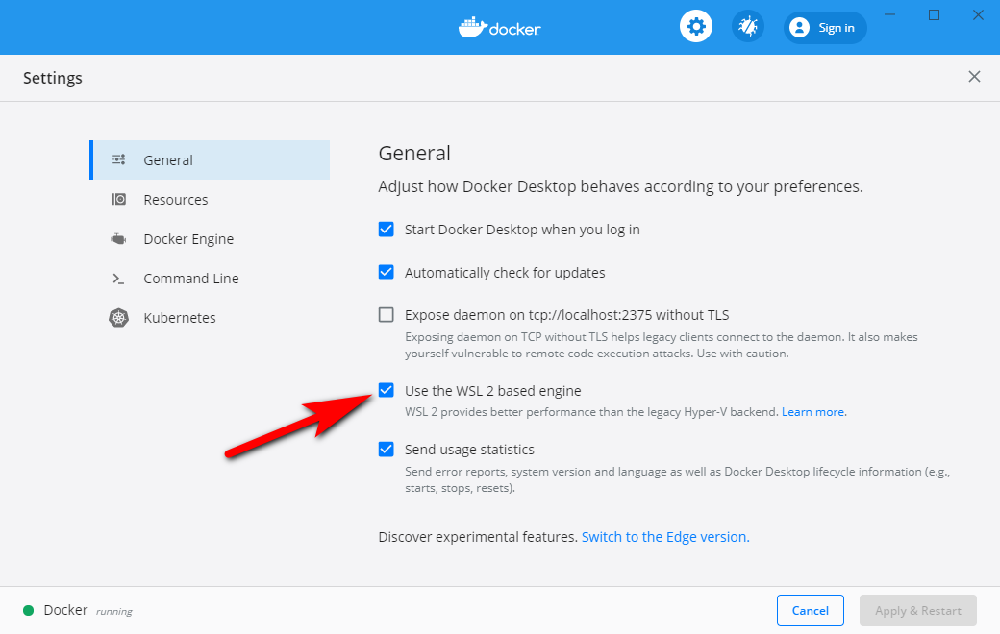
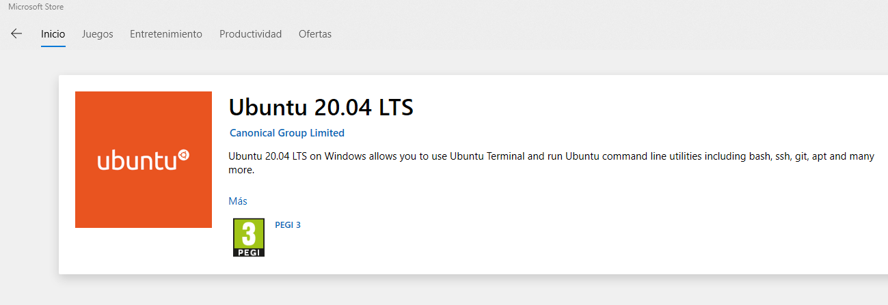
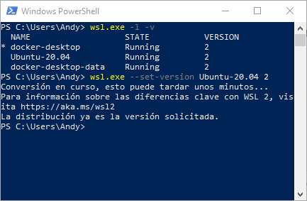
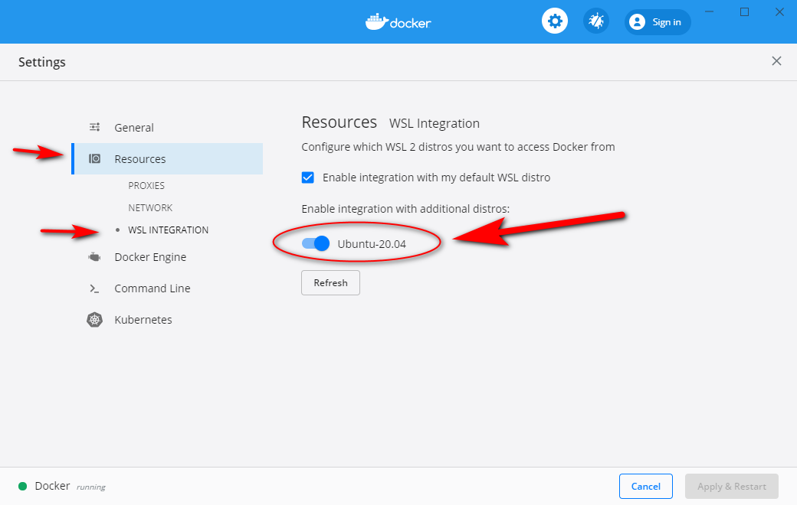
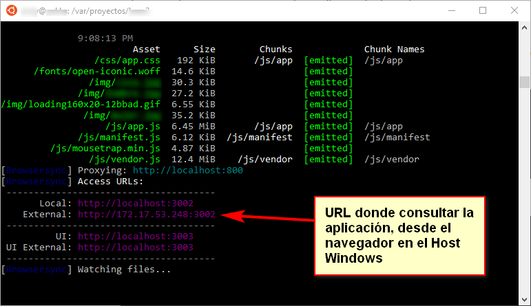

# Laravel con Docker

Se utiliza [laradock](https://laradock.io/) dado que ofrece la configuración por defecto
para todos los posibles contenedores.

[[TOC]]

## Referencias

- Como referencia básica, la propia documentación: [https://laradock.io/](https://laradock.io/)
- [Docker Desktop: WSL 2 Best practices](https://www.docker.com/blog/docker-desktop-wsl-2-best-practices/) (4 mayo 2020)


## Instalar Docker en Windows 10 con WSL-2

1. Instalar [Docker-desktop](https://docs.docker.com/docker-for-windows/install/). 
   Es necesario registrarse (crearse un usuario) para que te habilite la descarga
2. Testear que funciona bien, ejecutando en la línea de comandos:  
   ```bash
   docker --version
   ``` 
3. Añadir tu cuenta de usuario en el grupo local del ordenador "_Docker users_"
4. Instalar WSL-2 en Windows siguiendo paso a paso esta guía: [Windows Subsystem for Linux Installation Guide for Windows 10](https://docs.microsoft.com/en-us/windows/wsl/install-win10)
5. Activar en _Docker Desktop_ WSL-2. Se abre pinchando en el icono de la ballena de
   docker abajo a la derecha en los iconos del escritorio de Windows, y marcando la opción
   _Use the WSL 2 based engine_:  
   
6. Instalar la máquina de Ubuntu 20.04 LTS desde la tienda de Microsoft:
   
7. Asegurarnos de que la máquina Ubuntu funcionará con la versión 2 de WSL. Para ello, abrir una consola _powershell_,
   y si se encontrase en la versión 1, pasarla a la versión 2:  
   ```shell script
   wsl.exe -l -v                           # Listar máquinas y versión en que funcionan
   wsl.exe --set-version Ubuntu-20.04 2    # Pasar la máquina a versión 2 
   wslconfig /setdefault Ubuntu-20.04      # Poner por defecto Ubuntu
   ```
   Se puede observar en este pantallazo:  
      
7. Una vez instalada, buscarla en los programas instalados en Windows y entrar en esa máquina Linux de Ubuntu.
8. Para evitar el error por falta de memoria en la variable "max_map_count" es necesario añadir esta línea en el fichero
   ```sudo nano /etc/sysctl.conf``` y después ejecutar ```sudo sysctl -p``` para recargar la configuración:
   ```shell script
   vm.max_map_count=262144
   ```
9. Dentro de la máquina Ubuntu, añadir esto al fichero ```~/.profile``` del usuario con el que entraste en la máquina
   ([referencia](https://www.docker.com/blog/docker-desktop-wsl-2-best-practices/)):
   ```shell script
   cd ~
   
   # Añadir esta línea al final del fichero .profile
   export DOCKER_BUILDKIT=1.
   ```   
10. Activar la integración de la máquina Ubuntu con _Docker Desktop_, para lo cual abre la configuración de _Docker Desktop_
   y activa la "_WSL Integration" para esa máquina:    
   


Los pasos que vienen ahora están dirigidos a montar el proyecto **DENTRO DE LA MÁQUINA LINUX**, lo cual es de **vital
importancia** para que el rendimiento de docker pueda aprovechar la extrema velocidad de WSL-2. Si no se hace exactamente así,
el rendimiento caerá y será más de **10 veces más lento**.

::: warning Si hay problemas con la conexión a internet:
   ```shell script 
      sudo nano /etc/resolv.conf
   ```
   - Descomentar:
   ```shell script 
      generateResolvConf = false
   ```
   - Añadir:
   ```shell script
      Nameserver 8.8.8.8 #O las DNS del equipo local
   ```
:::

## Levantar el proyecto en contenedores docker

Si todavía no has "dockerizado" tu proyecto, es mejor pasar a la sección siguiente y después volver a este punto.

Este es el resúmen de dónde se va a ejecutar cada cosa:

- **Código fuente**: Se encontrará en la máquina Ubuntu. **NO se encontrará en una ruta Windows**, ni siquiera aunque la ruta
  pudiera ser alcanzada desde el linux a través de "_mnt_" con algo como ```/mnt/c/proyectos/mi-proyecto```.
- **Comandos de docker-compose**: serán lanzados desde dentro de la máquina Ubuntu
- **Yarn o npm**: serán lanzados desde dentro de la máquina Ubuntu
- **Composer**: serán lanzados desde dentro de la máquina Ubuntu, más concretamente desde el contenedor de "Workspace"
- **Navegador para probar la aplicación** mientras se desarrolla, con hot reloading: se abrirá el firefox desde el host Windows
- **VSCode para editar el código fuente**: se abrirá desde el host Windows

Para levantar el proyecto y ponerse a desarrollar en el mismo, hay que:

1. Busca la máquina Ubuntu y entra en ella
2. En una ruta propia del sistema linux de esa máquina, clona el código fuente del proyecto (supongamos que es el proyecto _dracma_):  
   ```shell script
   cd /var
   mkdir proyectos
   cd proyectos
   git clone https://git.cnmc.es/scm/drac/dracma.git
   cd dracma
   git config core.ignorecase false
   ```
   Añadir laradock y mssql al proyecto, estando en la raiz del proyecto:
   ```bash
   git submodule add https://github.com/laradock/laradock.git docker/laradock/
   git submodule add https://github.com/microsoft/mssql-docker.git docker/mssql-docker/
   git submodule init
   git submodule update
   ```
3. Continuando **dentro de la máquina Ubuntu**, instala los paquetes:  
   ```shell script
   cd /var/proyectos/dracma
   
   #Instalar nodejs, npm y yarn
   sudo apt update
   sudo apt install nodejs
   sudo apt install npm
   sudop npm install -g yarn

   yarn install              # Instalar paquetes javascript
      
   cp .env.example .env   
   ```
4.  En el fichero **docker/.env.example** hay que modificar dos líneas **imprescindibles** para el correcto funcionamiento de los contenedores, estás líneas son:
   ```shell script
    
   cd docker # Ubicación de .env de docker

   # Ambas lineas deben quedarse en blanco (del fichero .env.example de la carpeta docker)
   COMPOSE_CONVERT_WINDOWS_PATHS=   
   DOCKER_SYNC_STRATEGY= 

   cp .env.example .env
   ```
5. Levanta todos los contenedores de la aplicación:
   ```shell script
   cd /var/proyectos/dracma/docker   # path donde está docker-compose.yml
   sudo docker-compose build    # Este comando es necesario la primera vez, para generar las imágenes de los contenedores
   sudo docker-compose up -d    # Levantar contenedores definidos en docker-compose.yml
   sudo docker-compose ps       # Verificar situación
   #Ejecutar composer install en el contenedor workspace
   sudo docker-compose exec workspace bash
   composer install
   php artisan storage:link   #Nos permitirá visualizar las imágenes de los módulos
   ```
6. Continuando **denro de la máquina Ubuntu**, levanta el servidor-proxy de Laravel mix para el _autoreloading_, es decir, que 
   el navegador web se actualice automáticamente cuando vas modificando el código fuente, sin necesidad de pulsar F5 para
   recargar la página: 
   ```shell script
   cd /var/proyectos/dracma    # Raíz del proyecto
   yarn watch                  # Pulsar Ctrl-z para pararlo
   ```  
   
7. En Windows, **fuera de la máquina Ubuntu**, abrir el firefox (o cualquier otro navegador) y escribir la dirección
   que nos ha indicado el comando ```yarn watch``` del punto anterior. En este caso se puede ver que 
   es [http://172.17.53.248:3002](http://172.17.53.248:3002).    
   Cada vez que modifiquemos el código fuente de la aplicación, la web se **actualizará automáticamente** en el navegador.
8. Para modificar el código fuente, y programar, hemos de tener instalado [Visual Studio Code](https://code.visualstudio.com/),
   y activar la extensión **Remote - WSL**.
9. Abrir el explorador de Windows, y escribir en el path la ruta ```\\wsl$\Ubuntu-20.04\var\proyectos\dracma```, donde
   debemos poder observar todos los ficheros del proyecto. Esta es la forma de acceder a los ficheros de la máquina linux
   desde el navegador de Windows.         
10. En _VSCode_, abrir el proyecto mediante la opción del menú ```File -> Open folder```, especificar la ruta
   ```\\wsl$\Ubuntu-20.04\var\proyectos\dracma```, y comenzar a modificar el código fuente, observando cómo se 
   recarga automáticamente la web en el navegador abierto.


## Incorporar Docker al proyecto Laravel

Para incorporar y configurar los contenedores de docker a tu proyecto existente,
nos vamos a basar en las plantillas que vienen definidas en
[laradock](https://laradock.io/).

1. Toda la configuración de docker del proyecto la vamos a guardar en una nueva
   carpeta "_docker_":
   ```bash
   mkdir docker
   ```
2. Añadir _Laradock_ a tu proyecto. Estando en la raiz del mismo, 
   hay que añadir el paquete como un submódulo git:
   ```bash
   # Crear el fichero ".gitmodules" y 
   # descarga en la carpeta "laradock" el paquete completo de github
   git submodule add https://github.com/laradock/laradock.git docker/laradock/
   
   git submodule init     # descarga el código fuente
   git submodule update   # para revisar si hay actualizaciones, ejecutar de vez en cuando
   ```
   ::: tip
   Sólo hacer este paso si laradock todavía no ha sido incluido en tu proyecto antes.
   :::
3. Vamos a partir de la configuración de laradock, que ahorra mucho tiempo:
   ```bash
   cp docker/laradock/env-example        docker/.env
   cp docker/laradock/env-example        docker/.env.example
   cp docker/laradock/docker-compose.yml docker/docker-compose.yml
   ```
4. Los futuros logs y el fichero "_.env_" guardaremos la configuración concreta, así que 
   mejor ignorarla en un nuevo fichero "_docker/.gitignore_":
   ```bash
   .env
   logs
   ```   
5. Vigilar este parámetro en el fichero "_docker/.env_":
    ```
    NGINX_HOST_HTTP_PORT=800    # Después la aplicación funcionará en http://localhost:800
    ```
6. Dado que vamos a utilizar la configuración que se encuentra en "_docker/docker-compose.yml_",
    es necesario cambiar todas las rutas de ese fichero para que encuentren los
    "Dockerfile" de sus contenedores. Por ejemplo, donde pone:
    ```yaml
    ### NGINX Server #########################################
    nginx:
      build:
        context: ./nginx
    ``` 
    Hay que poner:
    ```yaml
    ### NGINX Server #########################################
        nginx:
          build:
            context: ./laradock/nginx    
    ```
    Se pueden eliminar los servicios que no se vayan a usar.
    Vigilar especialmente:
    ```yaml
    NGINX_SITES_PATH=./laradock/nginx/sites/      # Completar la ruta con la carpeta "laradock"
    NGINX_SSL_PATH=./laradock/nginx/ssl/          # lo mismo
    ```
7. Ajustar algún parámetro del fichero **docker/.env**, por ejemplo el prefijo de los contenedores:
   ```
   COMPOSE_PROJECT_NAME=miproyecto
   ```    
8. Como hemos puesto la aplicación en el puerto 800, hay que configurarlo en 
   la configuración general del proyecto (fichero **.env**), y algún otro parámetro:
    ```
    APP_URL=http://localhost:800/

    REDIS_HOST=redis
    ```
9. También en el fichero **webpack.mix.js**:
    ```js
    mix.browserSync({
        proxy: 'http://localhost:800'
    });
    ```
10. Ajustar la configuración de Postgres o de Microsoft SQLServer. Para ello, elegir
   cuál de los 2 vas a utilizar y después revisar en su apartado correspondiente más abajo:
     * [Postgres](#configurar-postgresql)
     * [Microsoft SQL Server](#configurar-sql-server)
11. Arrancar todos los contenedores:
    ```bash
    cd docker
    docker-compose build nginx redis workspace php-fpm  # Construir los contenedores para que cojan la configuración
    docker-compose up -d nginx redis workspace          # levantar las máquinas
    docker-compose ps                                   # para revisar la situación
    ```    
12. Ejecutar las migrations:
    ```bash
    docker-compose exec workspace bash    # Entrar en el contenedor del workspace
    php artisan migrate --seed
    exit                                  # salir del contenedor
    ```
13. La aplicación está corriendo en: [http://localhost:800](http://localhost:800)


## Operar con docker

Para revisar la situación, hay que situarse en la carpeta "docker" que es
donde se encuentra el fichero "_docker-compose.yml_" con la configuración
de los contenedores, y entonces:

```bash
docker ps                              # List current running Containers
docker-compose ps                      # List only this project containers
docker-compose up -d postgres          # Levantar los contenedores asociados al servicio postgres
docker-compose stop                    # Close all running Containers
docker-compose stop postgres           # stop single container
docker-compose down                    # delete all existing Containers

# Lo suyo es levantar todos de golpe:
docker-compose up -d nginx redis workspace postgres pgadmin sonarqube   # con PostgreSQL
docker-compose up -d nginx redis workspace mssql sonarqube              # con SQL Server

# Para ver los logs de un servicio (ej: postgres):
docker-compose logs postgres

# Para entrar en un container (run commands in a running Container)
docker-compose exec nginx bash
exit                                   # exit from a container
```

Para cambiar la configuración de los contenedores:

- Edit default container configuration: Open the ```docker-compose.yml``` and change anything you want.
- Edit a Docker Image: 
  - example for postgres it will be _postgres/Dockerfile_.
  - Edit the file the way you want.
  - Re-build the container: ```docker-compose build postgres```

Run Artisan Commands: hay que hacerlo desde el container _workspace_:

```bash
docker-compose up -d workspace # Make sure you have the workspace container running
docker-compose ps              # Find the Workspace container name
docker-compose exec --user=laradock workspace bash  # Enter the Workspace container

# Run anything you want:
php artisan
Composer update
phpunit

# apaga todo los servicios que levantó con docker-compose up
docker-compose down
```

**Reclaim cached memory**: WSL 2 automatically reclaims memory when it is freed, to make it available to 
Windows processes. However, if the kernel decides to keep content in cache (and with Docker, it tends to 
happen quite a lot), the amount of memory reclaimed might not be sufficient.

To reclaim more memory, after stopping your containers, you can run this as root to drop the kernel 
page cache and make WSL 2 reclaim memory used by its VM:
 
```bash 
echo 1 > /proc/sys/vm/drop_caches
```


Otras referencias:

- [View log files](https://laradock.io/documentation/#view-the-log-files) (de los containers)
- [Install PHP extensions](https://laradock.io/documentation/#install-php-extensions)
- [Install xDebug](https://laradock.io/documentation/#install-xdebug)
- [Install SonarQube](https://laradock.io/documentation/#install-sonarqube-automatic-code-review-tool)
- [Prepare Laradock for production](https://laradock.io/documentation/#prepare-laradock-for-production)


## Configurar PostgreSQL

Se pueden incorporar 2 nuevos contenedores:

- **postgres**: es el servidor de base de datos PostgreSQL
- **pgadmin**: es la herramienta web pgAdmin, una interfaz para acceder
  al servidor, crear y manipular bases de datos, hacer consultas, etc.  

Los pasos son:

1. Ajustar la configuración de postgres para que funcione (el volumen docker) en el fichero **docker-compose.yml**:
    ```yaml
    volumes:
      postgres:
        driver: ${VOLUMES_DRIVER}
      pgdata:                       # Añadir este volumen
        driver: ${VOLUMES_DRIVER}
    
    ### PostgreSQL ###########################################
        postgres:
          build: ./postgres
          volumes:
            #- ${DATA_PATH_HOST}/postgres:/var/lib/postgresql/data
            - pgdata:/var/lib/postgresql/data     # Esta es la línea que hay que añadir
            - ${POSTGRES_ENTRYPOINT_INITDB}:/docker-entrypoint-initdb.d 
    ```
2. Reconstruir los contenedores para que coja la nueva configuración:
   ```
   docker-compose build postgres pgadmin
   ```    
2. Ajustar la configuración en el fichero **.env**:
    ```
    DB_CONNECTION=pgsql
    DB_HOST=postgres
    DB_PORT=5432
    DB_DATABASE=postgres
    DB_USERNAME=default
    DB_PASSWORD=secret
    ```

## pgAdmin con docker

Para usar pgAdmin, la aplicación que te permite acceder a las bases de datos postgres a través de su interfaz gráfica:

1. Arranca los contenedores:
    ```bash
    cd docker
    docker-compose up -d postgres pgadmin
    docker-compose ps     # para revisar la situación
    ```    
2. Open your browser and visit the localhost on port 5050: 
   [http://localhost:5050](http://localhost:5050)
3. At login page use default credentials:
    - Username: **pgadmin4@pgadmin.org**
    - Password: **admin**
4. Para conectar, crear nueva base de datos con estos parámetros: 
    - Host name/Address: postgres
    - Port: 5432
    - Maintenance database: postgres
    - username: default
    - clave: secret
5. Si se necesita entrar en el postgres (en el contenedor) con línea de comandos:
    ```bash
    docker-compose exec --user=root postgres    
    ```


## Configurar SQL Server

1. El Dockerfile de laradock, no termina de funcionar.
   Por esa razón, la idea es utilizar el [repositorio oficial de Microsoft de recursos Docker para SQL Server](https://github.com/Microsoft/mssql-docker),
   para lo cual hay que añadirlo como submodulo git:
   ```bash
   git submodule add https://github.com/microsoft/mssql-docker.git docker/mssql-docker/
   git submodule init
   git submodule update
   ```
2. En el fichero "_laradock/docker-compose.yml_", realizamos algún ajuste 
   (el contenido que no no se muestra es porque no cambia):
    ```yaml
    ### MSSQL ################################################
        mssql:
          build:
            #context: ./mssql            # Dejar de usar el Dockerfile de laradock
            context: ./mssql-docker/linux/preview/examples/mssql-server-linux-non-root
          volumes:
            #- ${DATA_PATH_HOST}/mssql:/var/opt/mssql     # Esto no funciona
            - mssql:/var/opt/mssql                        # Añadir esta línea
          networks:
            - frontend                    # Añadimos esta red para poder conectarnos desde el PC
            - backend
    ```
3. En el fichero de configuración "_docker/.env_" hay que activar las opciones de Microsoft SQLServer (MSSQL):
   ```
   ### WORKSPACE #############################################
   WORKSPACE_INSTALL_MSSQL=true
   
   ### PHP_FPM ###############################################
   PHP_FPM_INSTALL_MSSQL=true
   
    ### MSSQL #################################################
    MSSQL_DATABASE=homestead
    MSSQL_PASSWORD=Secret-2-Secret
    MSSQL_PORT=1433
   ```
4. Definir que se utilice PHP v7.2, dado que el contenedor con la versión 7.3 por 
   ahora no viene con el driver para conectarse al SQL Server.
   En el mismo fichero "_docker/.env_":
   ```
   ### PHP Version ###########################################
   
   # Select a PHP version of the Workspace and PHP-FPM containers (Does not apply to HHVM). Accepted values: 7.3 - 7.2 - 7.1 - 7.0 - 5.6
   PHP_VERSION=7.2
   ```    
5. Levantar el servidor para ver si funciona:
    ```bash
    cd docker
    docker-compose build nginx redis workspace mssql php-fpm # Reconstruir los contenedores con la nueva configuración
    docker-compose up -d nginx redis workspace mssql         # Levantar las máquinas
    docker-compose ps                                        # Verificar que están levantadas
    ```
6. Verificar desde el PC que conectamos a la base de datos. Para ello, abrir el _Microsoft Management Studio_
   en el PC, y realizar esta conexión:
   
     * Server name: 127.0.0.1
     * Authentication: SQL Server Authentication
     * Login: sa
     * Password: Secret-2-Secret
7. Crear la base de datos, ya sea con el propio _Microsoft Management Studio_
   o de cualquier otra forma.
   El nombre no importa, pero ha de ser el mismo que se defina en el 
   fichero _.env_ de la aplicación.
   ```
   CREATE DATABASE homestead
   ```
8. Ajustar configuración del fichero "_.env_" en tu proyecto Laravel:
    ```
    DB_CONNECTION=sqlsrv
    DB_HOST=mssql
    #DB_HOST=mssql
    DB_PORT=1433
    DB_DATABASE=homestead
    DB_USERNAME=sa
    DB_PASSWORD=Secret-2-Secret
    ```
9. Lanzar las migrations:
    ```bash
    cd docker
    docker-compose exec workspace bash   # Entrar en el contenedor workspace
    php artisan migrate --seed
    exit                                 # Salir del contenedor
    ```


## Sonarqube con docker

Para instalar Sonarqube, tener en cuenta la [documentación](https://laradock.io/documentation/). 
Y está funcionando en:
 
   [http://localhost:9000](http://localhost:9000) (usuario: **admin**, clave: **admin**).
   
El contenedor de Sonarqube se levanta con el comando 
 ```bash
 docker-compose up -d sonarqube
 ```

### BD de Sonarqube en postgres

Si no funciona y al revisar los logs hay un problema de permisos de escritura en la carpeta de log, ejecutar: 
 ```bash
 docker-compose run --user=root --rm sonarqube chown sonarqube:sonarqube /opt/sonarqube/logs
 ```

Si la BD no está creada (se puede entrar en [pgAdmin](http://localhost:5050/browser/) y mirar si existe la BD _sonar_),
hay que ejecutar el script __:

 ```bash
 docker-compose exec postgres bash      # Entrar en el contenedor
 cd docker-entrypoint-initdb.d/
 bash init_sonarqube_db.sh
 exit                                    # Salir del contenedor
 ```

Ese fichero se encuentra en el proyecto, en _docker/laradock/postgres/docker-entrypoint-initdb.d/init_sonarqube_db.sh_. 
Si da algún problema en Windows del tipo _End of file_, sólo hay que editarlo con el IDE y añadirle un salto
de línea al final.

Si al iniciar el contenedor de sonarqube **el contenedor se apaga a los pocos segundos**, casi seguro que el problema viene derivado de la 
creación o conexión con la base de datos. Revisar la BD, y crearla de cero si es necesario con el script definido en el punto 1
de este apartado.

### Lanzar análisis (scanner)

Para ejecutar un análisis de Sonarqube, instalar el [scanner](https://docs.sonarqube.org/latest/analysis/scan/sonarscanner/) en tu máquina de desarrollo,
y después ejecutar en la línea de comandos de tu PC local, en la raiz del proyecto: 
```bash
sonar-scanner
```

Si la máquina de desarrollo es linux, lo mejor es añadir la ruta del escaner al path. Es decir, editar el fichero ```/etc/profile``` y añadir esta línea:

```bash
PATH=$PATH:/var/proyectos/sonar-scanner-cli-4.5.0.2216-linux/bin
```

## ElasticSearch con Docker

No utilizar los DockerFile de Laradock, dado que están desactualizados, y además la versión del contenedor
de ElasticSearch ha de coincidir con la de Kibana:

```bash
# Fichero ./docker/elasticsearch/Dockerfile
FROM docker.elastic.co/elasticsearch/elasticsearch:7.4.0
EXPOSE 9200 9300

# Fichero ./docker/kibana/Dockerfile
FROM docker.elastic.co/kibana/kibana:7.4.0
EXPOSE 5601
```


Para verificar que el servidor de ElasticSearch está funcionando, la prueba es realizar curl desde el
contenedor _workspace_:

```bash
docker-compose up -d workspace elasticsearch kibana
docker-compose exec workspace bash    # Entrar en el contenedor
curl -XGET elasticsearch:9200         # Muestra información del servidor, entre otra la versión de ElasticSearch
exit                                  # Salir del contenedor
```


## Beanstalkd con docker

Pendiente.


