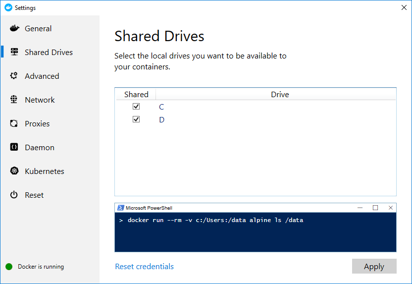
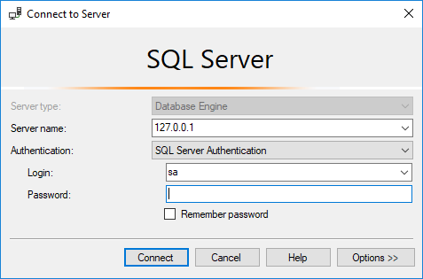

# Laravel con Docker

Se utiliza [laradock](https://laradock.io/) dado que ofrece la configuración por defecto
para todos los posibles contenedores.

[[TOC]]


## Instalación inicial

Como referencia básica, la propia documentación: [https://laradock.io/](https://laradock.io/):

1. Instalar [Docker-desktop](https://docs.docker.com/docker-for-windows/install/). 
   Es necesario registrarse (crearse un usuario) para que te habilite la descarga
2. Testear que funciona bien, ejecutando en la línea de comandos 
   ```bash
   docker --version
   ```
3. Pulsar con el botón derecho en el icono de docker donde los iconos de la barra de Windows al lado del reloj,
   opción "_Settings_", después "_Shared drives_", y verificar que está marcada la unidad donde se encuentra
   el proyecto:
      
4. Añadir tu cuenta de usuario en el grupo local del ordenador "_Docker users_"
5. Añadir _Laradock_ a tu proyecto. Estando en la raiz del mismo, hay el paquete de laradock como un submódulo git:
   ```bash
   # Crear el fichero ".gitmodules" y 
   # descarga en la carpeta "laradock" el paquete completo de github
   git submodule add https://github.com/laradock/laradock.git
   ```
   ::: tip
   Sólo hacer este paso si laradock todavía no ha sido incluido en tu proyecto antes.
   :::
6. Copiar el fichero "_laradock/env-example_" en el fichero "_laradock/.env_"
   (salvo que el proyecto ya tenga un fichero plantilla en "_.env-laradock_", por ejemplo), 
   y vigilar estos parámetros:
    ```
    NGINX_HOST_HTTP_PORT=800    # Después la aplicación funcionará en http://localhost:800
    ```
7. Como hemos puesto la aplicación en el puerto 800, hay que configurarlo en el **.env**:
    ```
    APP_URL=http://localhost:800/
    ```
8. También en el fichero **webpack.mix.js**:
    ```js
    mix.browserSync({
        proxy: 'http://localhost:800'
    });
    ```
9. Ajustar la configuración de Postgres o de Microsoft SQLServer. Para ello, elegir
   cuál de los 2 vas a utilizar y después revisar en su apartado correspondiente más abajo:
     * [Postgres](#configurar-postgresql)
     * [Microsoft SQL Server](#configurar-sql-server)
10. Arrancar todos los contenedores:
    ```bash
    cd laradock
    docker-compose build nginx redis workspace    # Construir los contenedores para que cojan la configuración
    docker-compose up -d nginx redis workspace    # levantar las máquinas
    docker-compose ps                             # para revisar la situación
    ```    
11. Ajustar la configuración de redis en el fichero **.env**:
    ```
    REDIS_HOST=redis
    ```
12. Ejecutar las migrations:
    ```bash
    docker-compose exec workspace bash    # Entrar en el contenedor del workspace
    php artisan migrate --seed
    exit                                  # salir del contenedor
    ```
13. La aplicación está corriendo en: [http://localhost:800](http://localhost:800)


## Operar con docker

Para revisar la situación:

```bash
docker ps                              # List current running Containers
docker-compose ps                      # List only this project containers
docker-compose up -d postgres          # Levantar los contenedores asociados al servicio postgres
docker-compose stop                    # Close all running Containers
docker-compose stop postgres           # stop single container
docker-compose down                    # delete all existing Containers

# Lo suyo es levantar todos de golpe:
docker-compose up -d nginx redis workspace postgres pgadmin sonarqube   # con PostgreSQL
docker-compose up -d nginx redis workspace mssql sonarqube              # con SQL Server

# Para ver los logs de un servicio (ej: postgres):
docker-compose logs postgres

# Para entrar en un container (run commands in a running Container)
docker-compose exec {container-name} bash
exit                                   # exit from a container
```

Para cambiar la configuración de los contenedores:

- Edit default container configuration: Open the ```docker-compose.yml``` and change anything you want.
- Edit a Docker Image: 
  - example for mysql it will be _mysql/Dockerfile_.
  - Edit the file the way you want.
  - Re-build the container: ```docker-compose build mysql```

Run Artisan Commands: hay que hacerlo desde el container _workspace_:

```bash
docker-compose up -d workspace # Make sure you have the workspace container running
docker-compose ps              # Find the Workspace container name
docker-compose exec --user=laradock workspace bash  # Enter the Workspace container

# Run anything you want:
php artisan
Composer update
phpunit

# apaga todo los servicios que levantó con docker-compose up
docker-compose down
```

Otras referencias:

- [View log files](https://laradock.io/documentation/#view-the-log-files) (de los containers)
- [Install PHP extensions](https://laradock.io/documentation/#install-php-extensions)
- [Install xDebug](https://laradock.io/documentation/#install-xdebug)
- [Install SonarQube](https://laradock.io/documentation/#install-sonarqube-automatic-code-review-tool)
- [Prepare Laradock for production](https://laradock.io/documentation/#prepare-laradock-for-production)


## Configurar PostgreSQL

Se pueden incorporar 2 nuevos contenedores:

- **postgres**: es el servidor de base de datos PostgreSQL
- **pgadmin**: es la herramienta web pgAdmin, una interfaz para acceder
  al servidor, crear y manipular bases de datos, hacer consultas, etc.  

Los pasos son:

1. Ajustar la configuración de postgres para que funcione (el volumen docker) en el fichero **docker-compose.yml**:
    ```yaml
    volumes:
      postgres:
        driver: ${VOLUMES_DRIVER}
      pgdata:                       # Añadir este volumen
        driver: ${VOLUMES_DRIVER}
    
    ### PostgreSQL ###########################################
        postgres:
          build: ./postgres
          volumes:
            #- ${DATA_PATH_HOST}/postgres:/var/lib/postgresql/data
            - pgdata:/var/lib/postgresql/data     # Esta es la línea que hay que añadir
            - ${POSTGRES_ENTRYPOINT_INITDB}:/docker-entrypoint-initdb.d 
    ```
2. Reconstruir los contenedores para que coja la nueva configuración:
   ```
   docker-compose build postgres pgadmin
   ```    
2. Ajustar la configuración en el fichero **.env**:
    ```
    DB_CONNECTION=pgsql
    DB_HOST=postgres
    DB_PORT=5432
    DB_DATABASE=postgres
    DB_USERNAME=default
    DB_PASSWORD=secret
    ```

## pgAdmin con docker

Para usar pgAdmin, la aplicación que te permite acceder a las bases de datos postgres a través de su interfaz gráfica:

1. Arranca los contenedores:
    ```bash
    cd laradock
    docker-compose up -d postgres pgadmin
    docker-compose ps     # para revisar la situación
    ```    
2. Open your browser and visit the localhost on port 5050: [http://localhost:5050](http://localhost:5050)
3. At login page use default credentials:
    - Username: **pgadmin4@pgadmin.org**
    - Password: **admin**
4. Para conectar, crear nueva base de datos con estos parámetros: 
    - Host name/Address: postgres
    - Port: 5432
    - Maintenance database: postgres
    - username: default
    - clave: secret
5. Si se necesita entrar en el postgres (en el contenedor) con línea de comandos:
    ```bash
    docker-compose exec --user=root postgres    
    ```


## Configurar SQL Server

1. El Dockerfile de laradock, no termina de funcionar.
   Por esa razón, la idea es utilizar el [repositorio oficial de Microsoft de recursos Docker para SQL Server](https://github.com/Microsoft/mssql-docker),
   por lo que creamos un fichero en el proyecto "_docker/mssql/Dockerfile_" con este contenido:
    ```
    # Exmple of creating a container image that will run as a user 'mssql' instead of root
    # This is example is based on the official image from Microsoft and effectively just changes the user that SQL Server runs as
    
    FROM microsoft/mssql-server-linux:latest
    
    RUN mkdir /var/opt/mssql && \
        useradd -d /var/opt/mssql -c "Microsoft SQL Server user" mssql && \
        chown mssql:mssql /var/opt/mssql -R
    
    USER mssql
    
    ENV HOME=/var/opt/mssql \
        APP_HOME=/var/opt/mssql
    
    CMD ["/opt/mssql/bin/sqlservr"]
    ```   
2. En el fichero "_laradock/docker-compose.yml_", realizamos algún ajuste 
   (el contenido que no no se muestra es porque no cambia):
    ```yaml
    ### MSSQL ################################################
        mssql:
          build:
            #context: ./mssql            # Dejar de usar el Dockerfile de laradock
            context: ../docker/mssql     # Usar el Dockerfile del punto 1
          volumes:
            #- ${DATA_PATH_HOST}/mssql:/var/opt/mssql     # Esto no funciona
            - mssql:/var/opt/mssql                        # Añadir esta línea
          networks:
            - frontend                    # Añadimos esta red para poder conectarnos desde el PC
            - backend
    ```
3. En el fichero de configuración "_laradock/.env_" hay que activar las opciones de Microsoft SQLServer (MSSQL):
   ```
   ### WORKSPACE #############################################
   WORKSPACE_INSTALL_MSSQL=true
   
   ### PHP_FPM ###############################################
   PHP_FPM_INSTALL_MSSQL=true
   
    ### MSSQL #################################################
    MSSQL_DATABASE=homestead
    MSSQL_PASSWORD=Secret-2-Secret
    MSSQL_PORT=1433
   ```
4. Definir que se utilice PHP v7.2, dado que el contenedor con la versión 7.3 por 
   ahora no viene con el driver para conectarse al SQL Server.
   En el mismo fichero "_laradock/.env_":
   ```
   ### PHP Version ###########################################
   
   # Select a PHP version of the Workspace and PHP-FPM containers (Does not apply to HHVM). Accepted values: 7.3 - 7.2 - 7.1 - 7.0 - 5.6
   PHP_VERSION=7.2
   ```    
5. Levantar el servidor para ver si funciona:
    ```bash
    cd laradock
    docker-compose build nginx redis workspace mssql   # Reconstruir los contenedores con la nueva configuración
    docker-compose up -d nginx redis workspace mssql   # Levantar las máquinas
    docker-compose ps                                  # Verificar que están levantadas
    ```
6. Verificar desde el PC que conectamos a la base de datos. Para ello, abrir el _Microsoft Management Studio_
   en el PC, y realizar esta conexión:
   
     * Server name: 127.0.0.1
     * Authentication: SQL Server Authentication
     * Login: sa
     * Password: Secret-2-Secret
7. Crear la base de datos, ya sea con el propio _Microsoft Management Studio_
   o de cualquier otra forma.
   El nombre no importa, pero ha de ser el mismo que se defina en el 
   fichero _.env_ de la aplicación.
   ```
   CREATE DATABASE homestead
   ```
8. Ajustar configuración del fichero "_.env_" en tu proyecto Laravel:
    ```
    DB_CONNECTION=sqlsrv
    DB_HOST=mssql
    #DB_HOST=mssql
    DB_PORT=1433
    DB_DATABASE=homestead
    DB_USERNAME=sa
    DB_PASSWORD=Secret-2-Secret
    ```
9. Lanzar las migrations:
    ```bash
    cd laradock
    docker-compose exec workspace bash
    php artisan migrate --seed
    ```


## Sonarqube con docker

1. Para instalar Sonarqube, tener en cuenta la [documentación](https://laradock.io/documentation/). 
   Y está funcionando en 
   [http://localhost:9000](http://localhost:9000) (usuario/clave: admin/admin).
   Algunos detalles que se han tenido en cuenta: 
   - El servicio se levanta con el comando 
     ```bash
     docker-compose up -d sonarqube
     ```
   - Si no funciona y al revisar los logs hay un problema de permisos de escritura en la carpeta de log,
     ejecutar: 
     ```bash
     docker-compose run --user=root --rm sonarqube chown sonarqube:sonarqube /opt/sonarqube/logs
     ```
   - Si la BD no está creada (se puede entrar en [pgAdmin](http://localhost:5050/browser/) y mirar si existe la BD _sonar_),
     hay que ejecutar el script __:
     ```bash
     docker-compose exec postgres bash      # Entrar en el contenedor
     cd docker-entrypoint-initdb.d/
     bash init_sonarqube_db.sh
     exit                                    # Salir del contenedor
     ```
     Ese fichero se encuentra en el proyecto, en _laradock/postgres/docker-entrypoint-initdb.d/init_sonarqube_db.sh_. 
     Si da algún problema en Windows del tipo _End of file_, sólo hay que editarlo con el IDE y añadirle un salto
     de línea al final.
2. Para ejecutar un análisis de Sonarqube, instalar el [scanner](https://docs.sonarqube.org/latest/analysis/scan/sonarscanner/) en tu PC de desarrollo,
    y después ejecutar en la línea de comandos de tu PC local, en la raiz del proyecto: 
    ```bash
    sonar-scanner
    ```

## Beanstalkd con docker

Pendiente.


