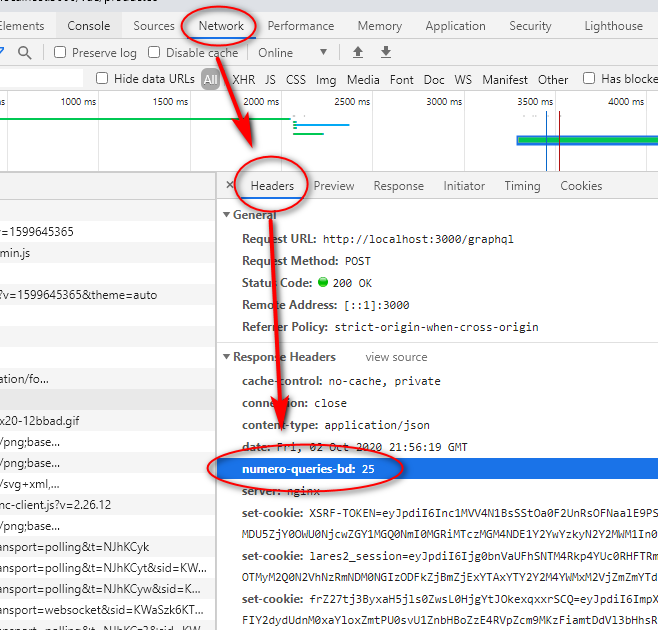

# Trabajando con la BD en Laravel

Tabla de contenidos:

[[TOC]]


## Registrar todas las consultas a BD 

Es muy útil implementar en la aplicación un mecanismo que permita identificar en un momento dado todas las queries
que se lanzan contra la base de datos. Y no sólo eso, sino incorporar una cabecera al objeto Response para saber cuántas
consultas contra la BD ha efectuado la petición HTTP en curso (tanto http "normal" como ajax).

Para poder activarlo únicamente cuando es necesario investigar el comportamiento de la aplicación, lo mejor es incluir
un parámetro de activación en el fichero ```.env```:

```dotenv
##################################################
### Log
##################################################
REGISTRAR_QUERIES_SQL=true
```

y mapearlo con su correspondiente parámetro de configuración en el fichero ```config/logging.php```:

```php
return [
    'registrarQueriesSQL' => env('REGISTRAR_QUERIES_SQL', false),
];
```

Crear un middleware que active el registro antes de la ejecución http ```app/Http/Middleware/registrarLoggingQueriesBD.php```:

```php
<?php
namespace App\Http\Middleware;
use Closure;
use Config;
use DB;
use Log;

class registrarLoggingQueriesBD
{
    const CONFIG_KEY_NumeroConsultasContraLaBD = "logging.numeroConsultasContraLaBD";
    const CONFIG_KEY_StringsConsultasContraLaBD = "logging.stringsConsultasContraLaBD";
    const MAX_QUERIES_A_INCLUIR_SU_SQL = 100;

    /**
     * Activa el registro de queries contra BD, antes de que esta Request comience a ser ejecutada
     * por la aplicación
     *
     * @param  \Illuminate\Http\Request  $request
     * @param  \Closure  $next
     * @return mixed
     */
    public function handle($request, Closure $next)
    {
        //registramos un listener de BBDD para hacer logging de todas las SQL
        if (config('logging.registrarQueriesSQL')) {

            // Creamos la entrada de configuración del número de queries ejecutadas:
            Config::set( self::CONFIG_KEY_NumeroConsultasContraLaBD, 0 );
            Config::set( self::CONFIG_KEY_StringsConsultasContraLaBD, "" );

            // Activamos la monitorización de Queries
            DB::enableQueryLog();
            DB::listen(function ($event)
            {
                // Sumamnos una al número de queries ejecutadas:
                $numQueriesQueLleva = intval(config( self::CONFIG_KEY_NumeroConsultasContraLaBD) );
                Config::set( self::CONFIG_KEY_NumeroConsultasContraLaBD, $numQueriesQueLleva + 1 );

                if ( $numQueriesQueLleva < self::MAX_QUERIES_A_INCLUIR_SU_SQL) {
                    // Esto es una protección  para no incluir una cabecera http monstruosa
                    $consultasActuales = config( self::CONFIG_KEY_StringsConsultasContraLaBD );
                    Config::set( self::CONFIG_KEY_StringsConsultasContraLaBD, $consultasActuales .
                        " ##### " . self::sustituirSaltosLineaPorEspacios( $event->sql ) .
                        "  " . serialize( $event->bindings) );
                }

                Log::debug('-------------------- NUEVA SQL ----------------------');
                Log::debug($event->sql);
                Log::debug( "Parámetros SQL: " . serialize( $event->bindings) );
            });
        }

        return $next($request);
    }

    protected function sustituirSaltosLineaPorEspacios( $string)
    {
        return trim(preg_replace('/\s+/', ' ', $string));
    }
}
```

Crear otro middleware para registrar el número de consultas finales una vez ejecutada la HTTP Request por la aplicación,
en el fichero  ```app/Http/Middleware/enviarLoggingQueriesBDAlCliente.php```:

```php
<?php
namespace App\Http\Middleware;
use Closure;
use Illuminate\Http\Response;

class enviarLoggingQueriesBDAlCliente
{

    /**
     * Cuando la aplicación ya ha gestionado la petición HTTP, al final, añade en el objeto Response
     * una cabecera con el número de queries que ha ejecutado contra la BD
     *
     * @param  \Illuminate\Http\Request  $request
     * @param  \Closure  $next
     * @return mixed
     */
    public function handle($request, Closure $next)
    {
        /** @var Response $response */
        $response = $next($request);

        if (config('logging.registrarQueriesSQL'))
        {
            return $response
                ->header('queries-bd-numero', config( registrarLoggingQueriesBD::CONFIG_KEY_NumeroConsultasContraLaBD) )
                ->header('queries-bd-strings', config( registrarLoggingQueriesBD::CONFIG_KEY_StringsConsultasContraLaBD) );
        }
        else
        {
            return $response;
        }
    }
}
```

Incluir esos 2 middlewares en el ciclo de todas las peticiones http que se realicen a la aplicación, en el 
fichero ```app/Http/kernel.php```:

```php
    protected $middleware = [
        ...
        \App\Http\Middleware\registrarLoggingQueriesBD::class,
        \App\Http\Middleware\enviarLoggingQueriesBDAlCliente::class
    ];
```

Y ya está. Cuando se active el parámetro en el fichero ```.env```, ya podremos consultar en el log de Laravel todas las consultas
a la base de datos que se hacen.
 
Además, en el navegador web podremos pulsar **F12** y en las consultas de red (normales, ajax, graphql...), 
mirar la cabecera *"numero-queries-bd"*:




## Count de una relación HasMany

Si tenemos una relación HasMany en un modelo de laravel (ej: Producto con relación DatoDiario)

```php
class Producto extends Model
{
    public function datosDiarios()
    {
        return $this->hasMany(DatoDiario::class, 'producto_id', 'id');
    }

    protected function getDatosDiariosCountAttribute( $value )
    {
        // Sólo realizará consulta a BD la primera vez que pregunte por el atributo
        return $value ?? 
               $this->datos_diarios_bolsa_count = $this->datosDiariosBolsa()->count();
    }
}
```

Siempre puedo cargar esa propiedad:

```php
$productos = Producto::withCount('datosDiarios')->get();  // todos los productos
```

Y si quiero realizar la carga ansiosa a mano de ese atributo:

```php
    /**
     * Devuelve todos los productos de la BD
     *
     * @param $parent
     * @param array $args
     * @return Collection
     * @inheritDoc $parent, $args, $context, $info
     */
    public function productos($parent, array $args, $context, $info)
    {
        $productos = Producto::fromQuery(<<<'FIN'

SELECT productos.id,
       productos.nombre,
	   productos.alias,
       COUNT("datosDiarios"."producto_id") AS "datos_diarios_count",
       CAST(MAX("datosDiarios"."fecha") AS TIMESTAMP) AS "fechaUltimoDatoDiario"
FROM "productos"
     LEFT OUTER JOIN "datosDiarios" ON ("datosDiarios"."producto_id" = "productos".id)
WHERE "productos"."deleted_at" IS NULL
GROUP BY productos.id,
         productos.nombre,
	     productos.alias
ORDER BY productos.alias

FIN
);

        return $productos;
    }
```


