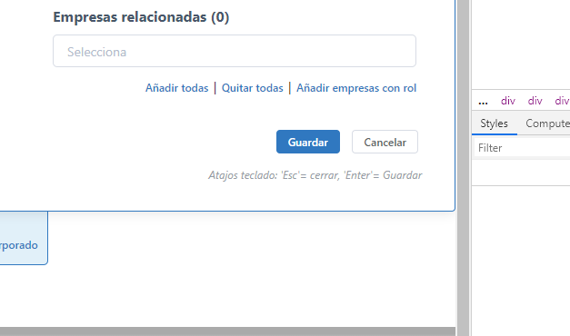

# CRUD (Create, Update, Delete)

Se denomina CRUD a las pantallas y funcionalidades necesarias que ofrece una aplicación para 
que, dado un tipo de elemento (un contacto, un expediente, un artículo, etc) se puedan:

- Añadir nuevos elementos de ese tipo (CREATE)
- Editar un elemento concreto (UPDATE)
- Eliminar un elemento concreto (DELETE)

A continuación se detallan los puntos de usabilidad a chequear:

[[TOC]]

## Botones "Guardar", "cancelar" y "eliminar"

Al poner los botones del final de un formulario, hay que tener en cuenta que han de estar
por orden de importancia de izquierda a derecha, es decir, por probabilidad de que el
usuario pulse sobre ellos. El color *primary* sólo ha de estar sobre la función principal
(que es "guardar").

Por ello los detalles a chequear sobre los botones del final en un formulario de edición son:

- El texto debe ser **"Guardar"** 
  (no *salvar*, *actualizar*, *entrar*, *ok* u otras cosas). La "G" mayúscula.
- El texto debe ser **"Cancelar"** 
  (no *volver*, *abortar*, *regresar* u otras cosas.
- El texto debe ser **"Eliminar"**
  (no *borrar*, *anular* u otras cosas).  
- Aparecen en ese **orden**: primero *Guardar*, después *Cancelar* y en su caso,
  por último *Eliminar*.

Con respecto a los estilos:

- El botón *Guardar* ha de tener el color sólido *primay*
- El botón *Cancelar* en realidad no debería ser un botón sino un enlace, por lo que
  ha de tener el estilo de un enlace, o en todo caso un estilado muy sutil, "outline" 
- El botón *Eliminar* es peligroso, por lo que ha de estar en color rojo y llamar
  poco la atención.   
 
Como últimos detalles:

- Alineados abajo a la derecha de la pantalla.
- Las teclas rápidas han de posicionarse debajo de los botones, en formato "muted"*
 
 Ejemplo:
 
 
 

